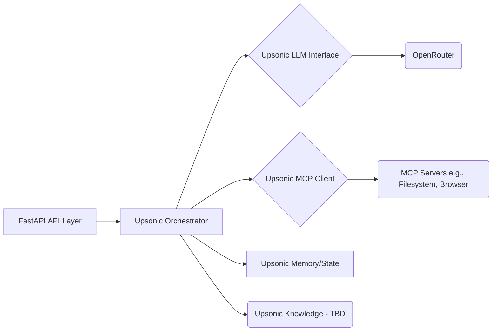

# System Patterns

## 1. Core Architecture
- **API Layer (FastAPI):** Provides the entry point for requests. Leverages FastAPI's async capabilities for efficient I/O handling, suitable for interacting with Upsonic and external services.
- **Orchestration Engine (Upsonic):** The central component responsible for managing workflows. Uses Upsonic Agents and Graphs.
- **LLM Interface (Upsonic -> OpenRouter):** Abstracted LLM calls routed through OpenRouter via Upsonic's configuration.
- **Tool Interface (Upsonic -> MCP):** Uses Upsonic's documented mechanism for MCP client implementation to interact with tools defined in `mcp-config.json`.
- **MCP Servers:** External, independent processes adhering to the MCP standard (e.g., filesystem, browser automation tools run by Cursor or standalone).

## 2. Key Technical Decisions
- **Framework:** Upsonic chosen for its focus on reliability, built-in features (Agents, Graphs, Memory, MCP support), and task-oriented design.
- **API Framework:** FastAPI selected for performance, async support, automatic documentation, and Python type hinting integration.
- **LLM Routing:** OpenRouter used for flexibility in model selection and centralized API key management.
- **Tool Protocol:** MCP adopted as the standard for tool interaction, promoting interoperability and leveraging existing tool servers.
- **Configuration:** `.env` for secrets/environment specifics and `mcp-config.json` for tool definitions, promoting separation of concerns.
- **Package Management:** `uv` chosen for speed and modern dependency management.

## 3. Design Patterns
- **Orchestrator Pattern:** The Upsonic backend acts as a central orchestrator, coordinating calls to LLMs and MCP tools.
- **Agent Pattern:** Upsonic Agents encapsulate specific capabilities or personalities, potentially assigned to specific nodes in a Graph.
- **Dependency Injection (via FastAPI):** Will be used in the API layer for managing dependencies like the Upsonic client/orchestrator instance.
- **Configuration Management:** Loading settings from `.env` and `mcp-config.json`.

## 4. Component Relationships

## 5. Critical Implementation Paths
- **Upsonic MCP Client Config:** Correctly parsing `mcp-config.json` and configuring the Upsonic client *strictly* per Upsonic documentation is paramount.
- **LLM-to-MCP Workflow:** The logic for prompting the LLM, parsing its plan, and translating it into Upsonic Graph/MCP calls.
- **Upsonic Graph Definition:** Accurately representing workflows within Upsonic's Graph structure.
- **Async Handling:** Proper use of `async/await` throughout the FastAPI and Upsonic interactions. 